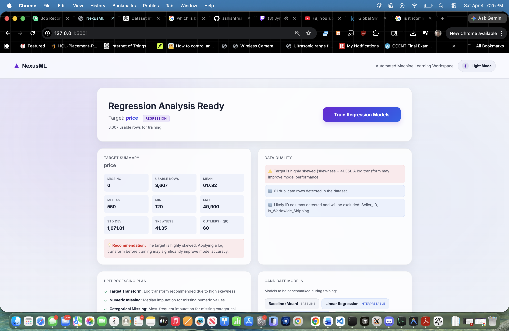
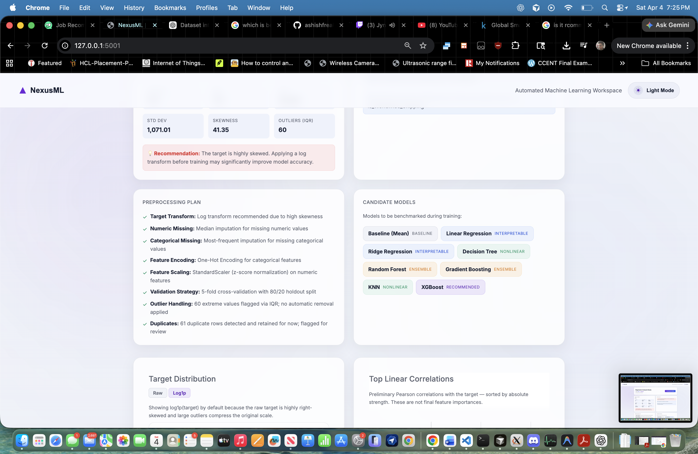
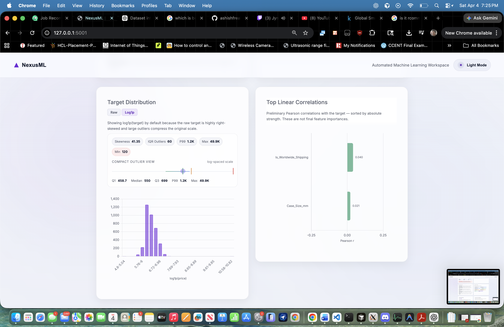
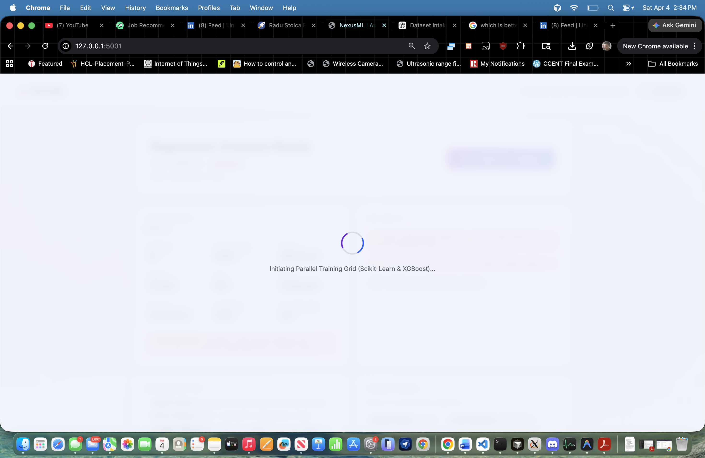
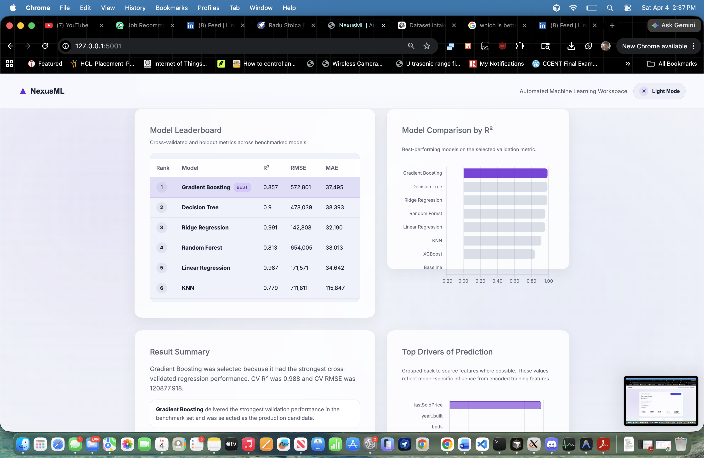
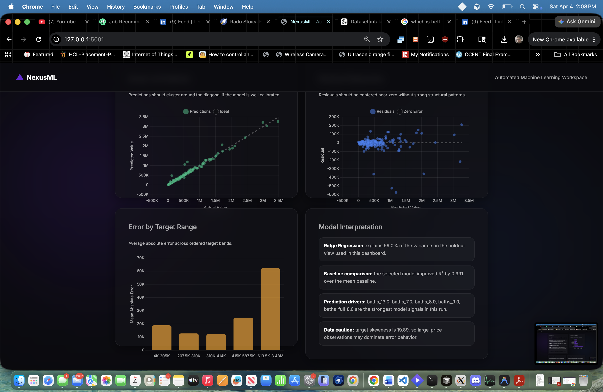

# Screenshot Walkthrough

This page compiles a curated set of screenshots from NexusML and explains what each screen demonstrates.

These screenshots are meant to help:
- GitHub visitors understand the product quickly
- interviewers see the application flow without running it
- reviewers understand how the ML pipeline is exposed through the UI

## 1. Analysis Overview

This is the pre-training analysis hero for a regression workflow.

What it shows:
- selected target and detected task type
- usable row count for training
- target summary statistics
- data-quality warnings such as skewness, duplicates, and likely ID columns

Why it matters:
- the app does not jump straight into training
- it first explains what kind of problem the user is solving and whether the data needs caution

## 2. Preprocessing Plan And Candidate Models

This screen turns backend preprocessing logic into a readable plan.

What it shows:
- how missing numeric and categorical values will be handled
- encoding and scaling strategy
- validation strategy
- duplicate and outlier notes
- the model families that will be benchmarked

Why it matters:
- it makes the AutoML workflow transparent instead of feeling like a black box

## 3. Target Distribution And Top Correlations

This screen focuses on target behavior before training.

What it shows:
- log-transformed target distribution for highly skewed regression targets
- compact outlier summary
- top preliminary linear correlations with the selected target

Why it matters:
- it helps the user understand why transforms or robust models may be needed
- it exposes early relationships without pretending they are final feature importances

## 4. Results Dashboard Hero

This is the main post-training summary area.

What it shows:
- best model name
- target
- primary selection metric
- holdout RMSE and MAE
- improvement over baseline
- actions for predictions and exporting results

Why it matters:
- the most important model outcome is visible immediately
- the dashboard is designed to be screenshot-friendly for demos and reviews

## 5. Leaderboard And Model Comparison

This section shows how models are ranked and compared.

What it shows:
- leaderboard table across benchmarked models
- cross-validated selection basis
- separate holdout metrics for context
- visual comparison chart for fast scanning

Why it matters:
- it makes the winner-selection logic easier to trust
- it reduces the risk of confusing a single holdout result with the actual ranking basis

## 6. Diagnostics And Interpretation

This darker results view highlights the deeper evaluation layer.

What it shows:
- actual vs predicted scatter plot
- residual diagnostics
- error by target range
- plain-English interpretation card

Why it matters:
- it pushes the workflow beyond a simple leaderboard
- it gives the user evidence for whether the chosen model is well-calibrated and where errors concentrate

## Recommended Use In Interviews

If you only show three screenshots, use:
1. analysis overview
2. results dashboard hero
3. diagnostics and interpretation

That sequence tells the clearest story:
- the app understands the data
- the app compares models
- the app explains the result

